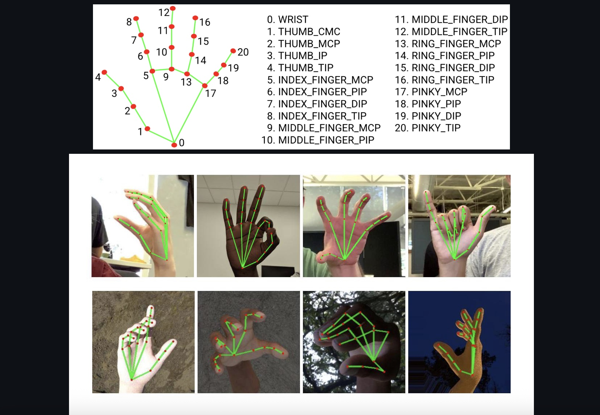

## 📸 Volume Brightness Controller

A Python-based hand gesture system to control **screen brightness** and **system volume** using your **webcam**. Built with `OpenCV`, `MediaPipe`, `pycaw`, and `screen_brightness_control`.

---

## ✨ Features

- 🖐️ **Control Brightness** using your **left hand** (distance between thumb and index finger).
- ✋ **Control Volume** using your **right hand** (distance between thumb and index finger).
- 🎥 Real-time webcam tracking with visual feedback.
- 🧠 Powered by **MediaPipe Hand Landmarks**.

---

## 🧰 Requirements

- Python 3.7+
- Webcam
 

Source: [MediaPipe Hands Solutions](https://google.github.io/mediapipe/solutions/hands#python-solution-api)

        

